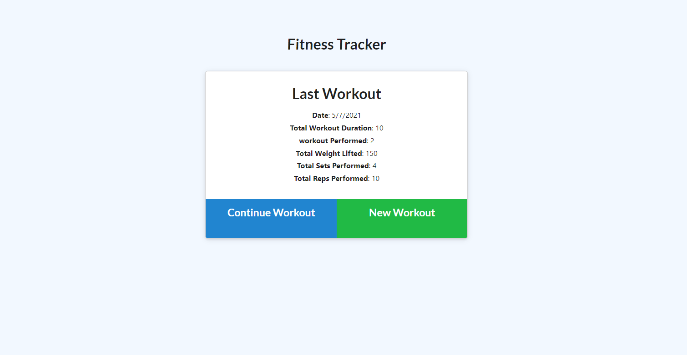

# Fitness_Tracker
  
### Description: 
This app deployed through heroku is connected to Mongo Atlas. It tracks daily workouts. 

### Table of Contents:
  - [Description](#description)
  - [Installation](#installation)
  - [Usage](#usage)
  - [Screenshot](#screenshot)
  - [Contributing](#contributing)
  - [Questions](#questions)
  - [License](#license)

### Installation:

### Usage:

### Screenshot:

 
 
GitHib Link: https://github.com/Bartok1945/fitness_tracker   

### Contributing:
Thom Huenger 
 
GitHub: [bartok1945](http://github.com/bartok1945)  

### Questions:
 
 
Email me: thom.huenger@gmail.com 
 

### License:

 
This application is covered by MIT. 

